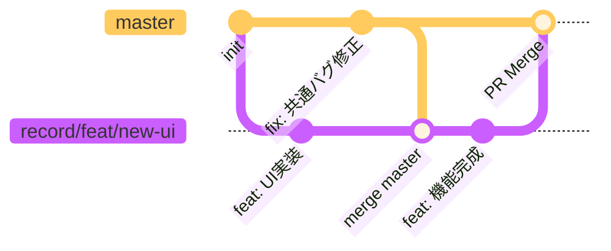

# Git 開発フローとガイドライン

このドキュメントでは、本プロジェクトにおける Git の運用ルール、ブランチ戦略、および開発フローについて

---

## 1. 運用方針の概要

本プロジェクトは **Record チーム** と **Edit チーム** による並行開発を行います。
開発の安全性とシンプルさを重視し、以下の原則を採用します。

- **ブランチ戦略**: **GitHub Flow** ベース（`master` + `アプリ名/*`）
- **履歴管理**: **Merge (マージ)** を基本とし、安全に履歴を残す
- **コミット規約**: **Conventional Commits**
- **並行開発**: アプリ単位（`apps/record`, `apps/edit`）で独立性を保ちつつ開発

---

## 2. ブランチ戦略 (Branching Strategy)

### ブランチ構成イメージ

**編集・プレビュー**: [Mermaid Chart Playground](https://www.mermaidchart.com/play?utm_source=mermaid_live_editor&utm_medium=share#pako:eNqNkF1LAkEYhf_KsLBsQRFBV3tZUAQVodTV3ozrqEPurIwjWbLg7iJYCUmBUPQF0YVF0seNlNaPGTW98i-0H2orWDSX5z3ve545OUHVo0iQBVHMYYKZDHIKAc6T4pitUJhKSCPJkzWIySKFRE1sQA05Q0dJM0SlmYCJ6gwytKRrGmZrMIKSji8Gk2kEjIFNYgnkr0dgGklj6jakGEaSKO1GA0n9ObOsExbG-97e_EIqKwFDIQYwRFEhQ17vkr8DcFQGiuD-SxEU4k1EEYSQqtMot01uN7h9w81ar3L0dfbmzSPe30AMQZahaI563jmCdmcz2D-dQOqOnmF_WYLprk0GW6vt2nX3thDk4Oall33KzQe_RG6WevkXbuX7jWLrvRJEbH3WOo-33LznZrXfOBhH8bcnZOOsDNqF517-nNtlbj35V4IQreZF5-6R205YlduvbuSIxjppH1e4ddj9aDhMYCq8R9Tp_5agIRpHA7IBTlByGSZX1aled-1mu1bqFMtB0mFFdW5fubVY9V9L8IMmsg2iNkNg3TUpgmB8AwFuNRI)



- **Merge の特徴**: 分岐と合流の履歴が明確に残ります。`rebase` は使用せず、安全な `merge` を使用します。

### ブランチの種類と役割

| ブランチ名         | 役割                                                           | 親ブランチ | マージ先 |
| :----------------- | :------------------------------------------------------------- | :--------- | :------- |
| `master`           | **プロダクションコード**<br>常にデプロイ可能で動作する状態。   | -          | -        |
| `{app}/feat/*`     | **新機能開発**<br>`{app}` は `record`, `edit`, `shared` など。 | `master`   | `master` |
| `{app}/fix/*`      | **バグ修正**<br>緊急度が高い修正や通常のバグ対応。             | `master`   | `master` |
| `{app}/refactor/*` | **リファクタリング**<br>機能変更を伴わないコード改善。         | `master`   | `master` |
| `{app}/perf/*`     | **パフォーマンス改善**<br>速度や効率の最適化。                 | `master`   | `master` |
| `docs/*`           | **ドキュメント更新**<br>ドキュメントのみの変更。               | `master`   | `master` |

### ブランチ命名規則

アプリ（スコープ）を先頭にし、その後にタイプ、内容を記述する **「アプリ名/タイプ/内容」** の形式を採用します。

**フォーマット**: `{app}/{type}/{description}`

| セグメント      | 説明                                     | 例                                 |
| :-------------- | :--------------------------------------- | :--------------------------------- |
| `{app}`         | 変更対象のアプリやスコープ               | `record`, `edit`, `shared`, `docs` |
| `{type}`        | 変更の種類 (Conventional Commits に準拠) | `feat`, `fix`, `refactor`, `perf`  |
| `{description}` | 具体的な変更内容 (ケバブケース)          | `new-ui`, `fix-playback`           |

### 具体的な運用例

| チーム     | ブランチ名の例                                                | 親ブランチ | マージ先 |
| :--------- | :------------------------------------------------------------ | :--------- | :------- |
| **Record** | `record/feat/audio-recorder`<br>`record/fix/playback-bug`     | `master`   | `master` |
| **Edit**   | `edit/feat/text-editor`<br>`edit/perf/rendering`              | `master`   | `master` |
| **共通**   | `shared/feat/ui-button-update`<br>`docs/feat/update-workflow` | `master`   | `master` |

---

## 3. Merge を活用した開発フロー

本プロジェクトでは、安全性とシンプルさを重視し、**Merge フロー** を採用します。
`master` の変更を取り込む際は、`rebase` ではなく `merge` を行います。

### ケース 1: 通常の開発フロー (順調な場合)

他者との競合がなく、スムーズに開発が進む場合の基本フローです。

#### 1. 作業ブランチの作成

最新の `master` から新しいブランチを作成します。

```bash
# 1. master を最新にする
git checkout master
git pull origin master

# 2. 作業ブランチを作成 (例: Recordチーム)
git checkout -b record/feat/new-feature
```

#### 2. 開発とコミット

こまめにコミットを行います。

```bash
git add .
git commit -m "feat(record): 基本的なUIを実装"
```

#### 3. リモートへプッシュ

作業内容をリモートリポジトリへアップロードします。

```bash
git push origin record/feat/new-feature
```

#### 4. Pull Request (PR) 作成 & マージ

GitHub 上で PR を作成し、レビュー後に `master` へマージします。

---

### ケース 2: master と差分が出た場合

自分の作業中に、他の誰かが `master` に変更をマージし、`master` が進んでしまった場合。
**最新の `master` を自分の作業ブランチにマージして、変更を取り込みます。**

#### 1. ローカルの master を最新にする

まず、手元の `master` を最新状態に更新します。

```bash
git checkout master
git pull origin master
```

#### 2. 作業ブランチに戻り、Merge を実行

自分のブランチに `master` の変更を取り込みます。

```bash
git checkout record/feat/new-feature
git merge master
```

この時、エディタが起動してコミットメッセージの入力を求められる場合がありますが、そのまま保存して終了すれば OK です（デフォルトのメッセージ `Merge branch 'master' into ...` が使用されます）。

#### 3. コンフリクト解消 (もし発生したら)

「コンフリクト（競合）」が発生した場合、Git は自動マージを停止します。以下の手順で解消します。

1. **競合箇所を修正**: エディタで `<<<<<<<`, `=======`, `>>>>>>>` で囲まれた箇所を確認し、正しいコードに修正します。
2. **修正をステージング**:
   ```bash
   git add <修正したファイル>
   ```
3. **マージコミットを作成**:
   ```bash
   git commit
   ```
   ※ 自動的にマージ完了のコミットメッセージが生成されます。

#### 4. プッシュ (通常通りで OK)

Merge は履歴を書き換えないため、強制プッシュ（`--force`）は不要です。

```bash
git push origin record/feat/new-feature
```

---

### ケース 3: 作業完了後、PR 作成前

PR を作る直前に一度 `merge master`（ケース 2 の手順）を行っておくと、マージ時のコンフリクトを事前に防げるため推奨されます。

---

## 4. 運用ルールと注意点

### チームごとの責務範囲

| チーム            | 担当ディレクトリ                                    | 権限とルール                                                                                          |
| :---------------- | :-------------------------------------------------- | :---------------------------------------------------------------------------------------------------- |
| **Record チーム** | `src/apps/record/`                                  | 自由に開発・修正可能。<br>他チームへの影響はない。<br>PR タイトルに `[Record]` を付ける。             |
| **Edit チーム**   | `src/apps/edit/`                                    | 自由に開発・修正可能。<br>他チームへの影響はない。<br>PR タイトルに `[Edit]` を付ける。               |
| **共通 (Shared)** | `src/shared/`<br>`src/router.tsx`<br>`src/theme.ts` | **全チームに影響する。**<br>変更時は他チームのレビューが必須。<br>PR タイトルに `[Shared]` を付ける。 |

### コミットメッセージ規約

**Conventional Commits** を採用します。
可読性を高め、将来的な自動化（CHANGELOG 生成など）に対応するためです。

**フォーマット**: `type(scope): subject`

| Type       | 用途               | 例                                           |
| :--------- | :----------------- | :------------------------------------------- |
| `feat`     | 新機能             | `feat(record): 録音機能を追加`               |
| `fix`      | バグ修正           | `fix(edit): 保存時のエラーを修正`            |
| `docs`     | ドキュメント       | `docs: READMEを更新`                         |
| `style`    | フォーマット       | `style: インデント修正`                      |
| `refactor` | リファクタリング   | `refactor(shared): ボタンコンポーネント整理` |
| `perf`     | パフォーマンス改善 | `perf(edit): レンダリング速度を最適化`       |
| `chore`    | その他             | `chore: 依存パッケージ更新`                  |

### 命名の具体例 (Naming Examples)

PR のタイトルとコミットメッセージは、レビュアーや将来の自分が理解しやすいように具体的かつ簡潔に記述します。

| ケース                     | PR タイトル例                                | コミットメッセージ例                                                                         |
| :------------------------- | :------------------------------------------- | :------------------------------------------------------------------------------------------- |
| **Record アプリの新機能**  | `[Record] feat: 波形表示機能の実装`          | `feat(record): 波形表示コンポーネントを追加`<br>`feat(record): 再生位置の同期処理を実装`     |
| **Edit アプリのバグ修正**  | `[Edit] fix: テキスト保存時のクラッシュ修正` | `fix(edit): 保存時の Null チェックを追加`<br>`test(edit): 保存処理のテストケース追加`        |
| **共通コンポーネント変更** | `[Shared] feat: Button にアイコン対応`       | `feat(shared): Button に icon プロパティを追加`<br>`style(shared): アイコンのレイアウト調整` |
| **ドキュメント更新**       | `docs: 開発ガイドラインの更新`               | `docs: GIT_WORKFLOW に命名規則を追加`                                                        |
| **リファクタリング**       | `[Record] refactor: 録音ロジックの整理`      | `refactor(record): useAudioRecorder フックを分離`                                            |

**ポイント:**

- **PR タイトル**: どのチーム・領域への変更かが一目でわかるように `[Record]`, `[Edit]`, `[Shared]` などのプレフィックスを付けることを推奨します。
- **コミットメッセージ**: `type(scope): subject` の形式を守り、変更内容を具体的に書きます。

---

## 5. よくあるシナリオ (Cookbook)

### シナリオ A: 誤って master にコミットしてしまった

ローカルの `master` で作業してしまい、プッシュしようとしたら拒否された場合の対処法です。

```bash
# 1. 変更内容を退避して新しいブランチを作成・移動
git branch record/feat/forgotten-branch
git checkout record/feat/forgotten-branch

# 2. master を元の状態に戻す（origin/master と同期）
git branch -f master origin/master

# 3. 新しいブランチをプッシュ
git push origin record/feat/forgotten-branch
```

### シナリオ B: 共通コンポーネントを修正したい

`apps/record` で使いたい機能が `shared/components/Button` に足りない場合。

1. ブランチ `shared/feat/button-update` を作成
2. `src/shared/components/Button` を修正
3. `feat(shared): Buttonにloadingプロパティを追加` でコミット
4. PR を作成し、タイトルを `[Shared] feat: Button更新` とする
5. **Edit チーム** にレビューを依頼する
6. 承認後、マージ
